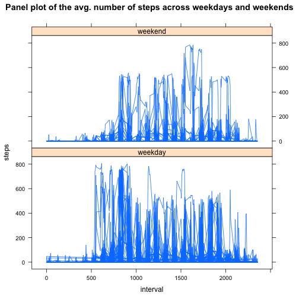

## Loading and preprocessing the data

To load the data, we have to load the activity.csv file that is compressed in
the activity.zip file.


```r
data <- read.csv(unz("activity.zip","activity.csv"))
```

To give a preview of our data, let's see the structure of it.


```r
str(data)
```

```
## 'data.frame':	17568 obs. of  3 variables:
##  $ steps   : int  NA NA NA NA NA NA NA NA NA NA ...
##  $ date    : Factor w/ 61 levels "2012-10-01","2012-10-02",..: 1 1 1 1 1 1 1 1 1 1 ...
##  $ interval: int  0 5 10 15 20 25 30 35 40 45 ...
```

Since the date column is of different class than it has to be, let's convert it.


```r
data$date <- as.Date(data$date)
```

## What is mean total number of steps taken per day?

Let's calculate total number of steps taken each day, also mean and median.


```r
sumSteps <- tapply(data$steps, data$date, sum, na.rm=TRUE)
meanSteps <- mean(sumSteps)
medianSteps <- median(sumSteps)
```

You can see a histogram on the total number of steps taken each day


```r
hist(sumSteps)
```

 

The mean total number of steps taken per day is 9354.2295082 and the median total number of steps is 10395.

## What is the average daily activity pattern?

Let's make a time series plot of the 5-minute interval (x-axis) and the average number of steps taken, averaged across all days (y-axis)


```r
meanStepsInterval <- tapply(data$steps, data$interval, mean, na.rm=TRUE)
plot(meanStepsInterval, type="l")
```

 

```r
maxStepsInt <- which(meanStepsInterval==max(meanStepsInterval))
```

The 835 interval on average across all the days in the dataset, contains the maximum number of steps.

## Imputing missing values

There is a number of days/intervals where there are missing values. The presence of missing days may introduce bias into some calculations or summaries of the data.  


```r
missingRows <- sum(is.na(data))
```

There are a total of 2304 missing values in the dataset.

Let's create a new dataset that is equal to the original dataset but with the missing data filled in. We fill the missing data with the mean value of the interval where data is missing.


```r
data2 <- data
for (i in 1:nrow(data2)){
        if (is.na(data2$steps[i])){
                p <- data$interval[i]
                data2$steps[i] <- meanStepsInterval[as.character(p)]
        }
}
```

You can see the histagram of the total number of steps taken each day with the filled missing value


```r
sumSteps2 <- tapply(data2$steps, data2$date, sum)
hist(sumSteps2)
```

 

```r
meanSteps2 <- mean(sumSteps2)
medianSteps2 <- median(sumSteps2)
```

With the new filled in data set the mean value is 1.0766189 &times; 10<sup>4</sup> and before it was 9354.2295082. The median is 1.0766189 &times; 10<sup>4</sup>, and before it was 10395. The mean and median have both increased as a result of imputing the missing values.

## Are there differences in activity patterns between weekdays and weekends?

Let's create a new factor variable in the dataset with two levels – "weekday" and "weekend" indicating whether a given date is a weekday or weekend day.


```r
library(lattice)
day.type <- strftime(data$date, "%w") ## Weekday as decimal number (0–6, Sunday is 0)
day.type <- as.character(day.type)
for (i in 1:length(day.type)){
        if (day.type[i] =="0" | day.type[i] =="6") {
                day.type[i] <- "weekend"
                }
        else{
                day.type[i] <- "weekday"                
        } 
}
day.type <- factor(day.type)
data2 <- cbind(data2, day.type)
```

Here is a panel plot containing a time series plot of the 5-minute interval (x-axis) and the average number of steps taken, averaged across all weekday days or weekend days (y-axis)


```r
xyplot(steps ~ interval | day.type, data=data2, type="l", layout=c(1,2))
```

 
